# lifecycle 源码解析

本文以 `lifecycle` 1.0 当前实现为准，从公开入口一路追踪到状态机、Navigator、分页和
Viewport 的内部调用链。阅读前建议先了解[技术原理](TECHNICAL_PRINCIPLES_CN.md)。

## 1. 推荐阅读顺序

如果第一次阅读源码，建议按以下顺序：

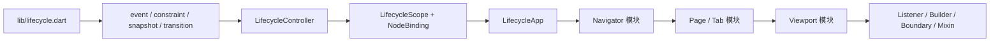

这条路线先建立数据模型，再理解状态如何在 Widget 树中传播，最后阅读各信号适配器。

## 2. 目录与公开边界

```text
lib/
├── lifecycle.dart                       # 唯一公开入口
└── src/
    ├── app/                             # AppLifecycleState 适配
    ├── core/                            # 状态模型、Controller、Scope、Binding
    ├── navigation/                      # Navigator 路由历史与透明度
    ├── page/                            # PageView / TabBarView
    ├── viewport/                        # Scrollable 二维可见性
    └── widgets/                         # 业务消费组件
```

[lib/lifecycle.dart](../lib/lifecycle.dart) 只导出稳定 API。以下实现有意保持包内私有：

- `LifecycleNodeBinding`：Widget 节点装配细节。
- `LifecycleRouteResolverScope` 和 `resolveLifecycleParent`：Route 解析协议。
- `_NavigatorLifecycleObserver`：Navigator 回调适配器。
- `_RouteLifecycleEntry`：Route 与 Controller 的内部配对。
- `IndexedLifecycleRegistry` 和 `IndexedLifecycleScope`：Page/Tab host 管理。
- Viewport Coordinator 和 RenderObject observer。

公开入口通过 `show` 限制部分导出，调用方无法依赖内部路由 entry 或注册表，从而允许
实现继续重构而不扩大兼容面。

## 3. 模块依赖图

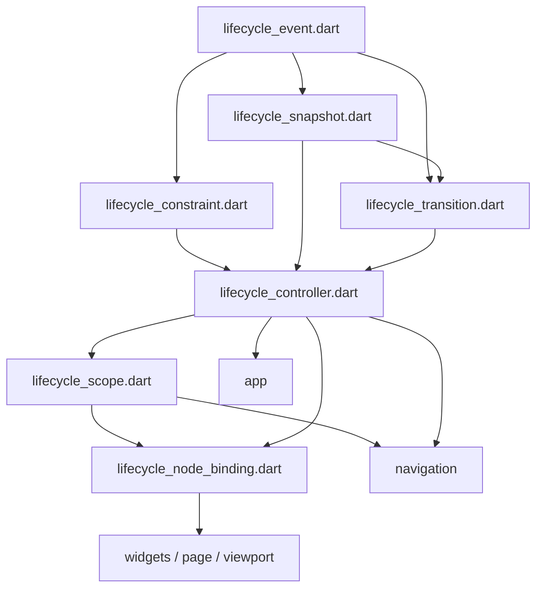

`core` 不依赖具体业务容器；上层模块只把各自信号转换为 `LifecycleConstraint`，所有
状态合成和事件推导最终都回到 `LifecycleController`。

## 4. 数据模型源码

### 4.1 lifecycle_event.dart

[lifecycle_event.dart](../lib/src/core/lifecycle_event.dart) 定义三个互相独立的枚举：

- `LifecyclePhase`：稳定状态。
- `LifecycleEvent`：两个状态之间的语义边沿。
- `LifecycleCause`：变化来源。

这种拆分避免把“当前是什么”“刚刚发生了什么”“谁触发的”塞进同一个枚举。尤其是
`visibleFraction` 变化时 Phase 不变、Event 为空，但仍然有带 Cause 的 Transition。

### 4.2 lifecycle_constraint.dart

[lifecycle_constraint.dart](../lib/src/core/lifecycle_constraint.dart) 使用三个 const 命名构造器
建立不变量：

```dart
const LifecycleConstraint.hidden();
const LifecycleConstraint.visible(visibleFraction: 0.5);
const LifecycleConstraint.active(visibleFraction: 1);
```

`visible` 和 `active` getter 只从 `phase` 派生。`==` 与 `hashCode` 使用 Phase 和比例，
因此上层每帧重复提交相同量化值时，Controller 能直接短路。

### 4.3 lifecycle_snapshot.dart

[lifecycle_snapshot.dart](../lib/src/core/lifecycle_snapshot.dart) 在 Constraint 的三个运行阶段
之外增加 `detached` 和 `disposed`。所有字段不可变且实现值相等。

`attached` 使用 Dart pattern switch 从 Phase 派生；`visible`、`active` 同理。这保证不会
出现 Phase 与多个缓存布尔字段彼此不一致的问题。

### 4.4 lifecycle_transition.dart

[lifecycle_transition.dart](../lib/src/core/lifecycle_transition.dart) 在构造时执行
`List.unmodifiable(events)`。调用方即使继续修改生成事件时使用的原 List，也不能改变
已经交付的 Transition。

两个回调类型分别对应两种粒度：

```dart
void Function(LifecycleTransition transition)
void Function(LifecycleEvent event, LifecycleTransition transition)
```

第二种回调保留完整 Transition 参数，因此处理某个 Event 时仍能读取 Cause、前后快照和
同批次的其他 Event。

## 5. LifecycleController：核心状态机

[lifecycle_controller.dart](../lib/src/core/lifecycle_controller.dart) 是整个库唯一执行状态合成
和事件推导的地方。它继承 `ChangeNotifier` 并实现
`ValueListenable<LifecycleSnapshot>`。

### 5.1 关键字段

| 字段 | 作用 |
| --- | --- |
| `_localConstraint` | 当前节点的本地状态上限 |
| `_localAppState` | 可选的 App 状态覆盖值 |
| `_parent` | 直接父 Controller |
| `_value` | 最近一次有效 Snapshot |
| `_lastTransition` | 产生 `_value` 的最近 Transition |
| `_attached` / `_disposed` | 节点结构状态 |
| `_terminalAppState` | dispose 前保存的最终有效 App 状态 |
| `_emitting` | 当前是否正在通知监听器 |
| `_recomputePending` | 通知期间是否又发生更新 |
| `_pendingCause` | 待处理更新的最近 Cause |
| `_disposeAfterEmission` | 是否在通知完成后 finalize dispose |
| `_changeNotifierDisposed` | 防止重复调用 `super.dispose()` |

### 5.2 attach

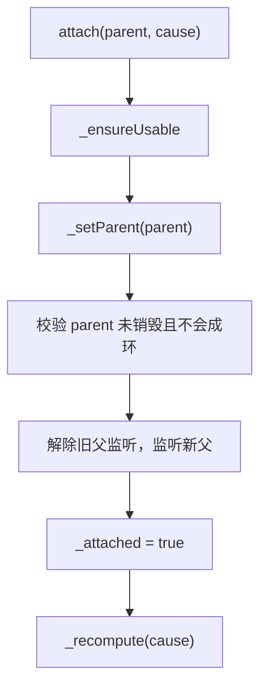

`_validateParent` 在解除旧父监听之前遍历候选父链。发现自身出现在祖先链时抛出
`ArgumentError`，原树保持不变。

### 5.3 reparent

`reparent` 复用现有 Controller 身份：

1. 相同父对象直接返回。
2. 校验新父级。
3. 从旧父移除 `_handleParentChanged` 监听。
4. 监听新父并立即重新计算有效快照。

Widget 的 `didChangeDependencies` 可能因 Route、InheritedWidget 或树结构变化多次执行，
因此 reparent 的幂等性非常重要。

### 5.4 updateLocal

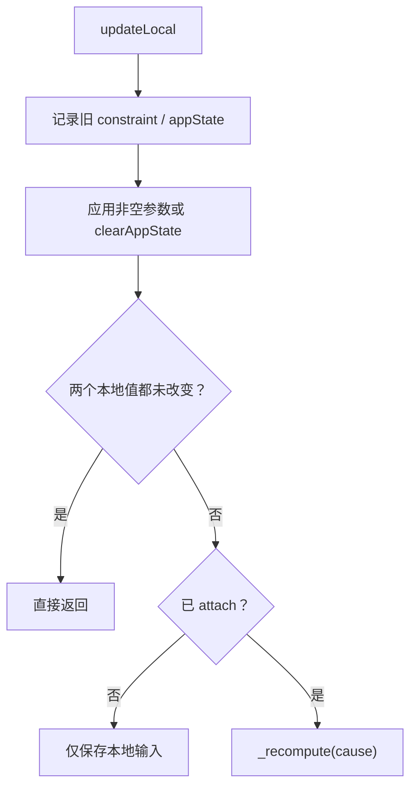

父节点变化不依赖 `updateLocal`，而是通过父监听 `_handleParentChanged` 单独触发，所以本地
等值短路不会漏掉祖先变化。

### 5.5 _buildSnapshot

`_buildSnapshot` 按以下优先级生成状态：

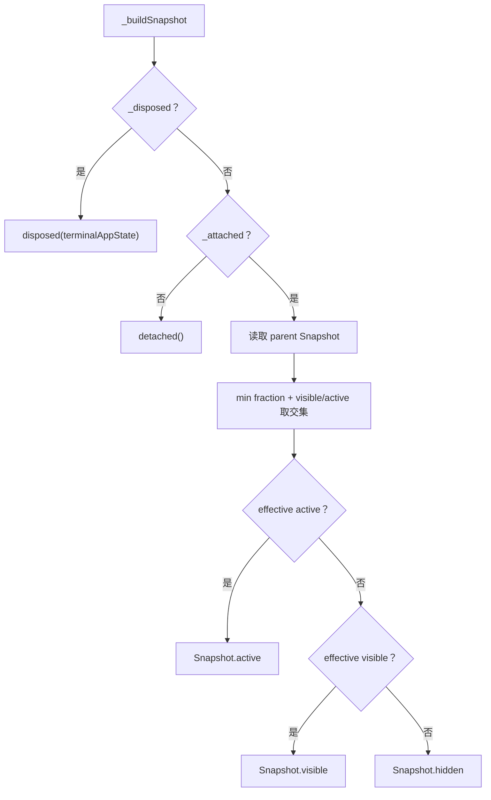

父节点为空时使用 `visible = true`、`active = true`、`fraction = 1` 作为单位元。App 状态
使用 `_localAppState ?? parentSnapshot?.appState`，因此局部覆盖优先。

### 5.6 _recompute 与通知队列

核心循环的逻辑可简化为：

```text
if already emitting:
  mark pending and remember cause
  return

do:
  clear pending
  build current snapshot
  if current != previous:
    save current
    create and save transition
    notify listeners synchronously
while another update became pending during notification

if dispose was requested during notification:
  finalize ChangeNotifier disposal
```

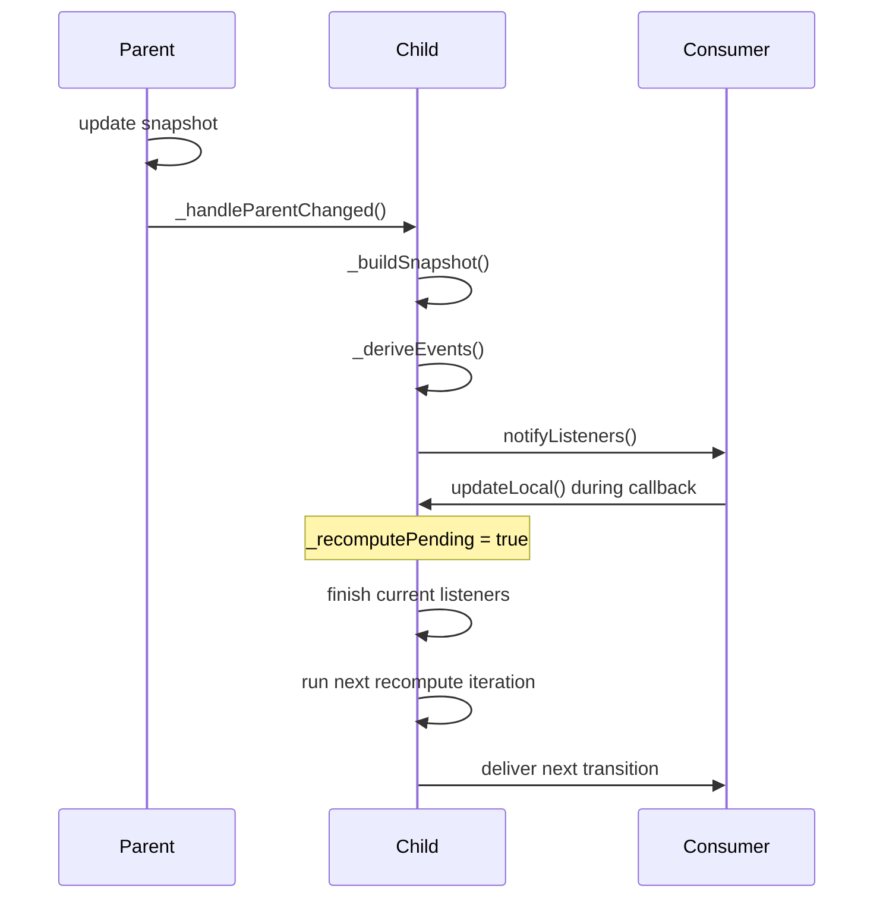

当一次通知期间发生多次更新时，中间本地输入会被合并，下一轮使用最后保存的输入与
Cause。这样避免递归栈增长，同时保证已交付 Transition 之间连续。

### 5.7 _deriveEvents

事件推导严格按以下代码顺序：

1. 未 attach -> attach：`created`
2. active -> 非 active：`deactivated`
3. visible -> 非 visible：`disappeared`
4. 非 visible -> visible：`appeared`
5. 非 active -> active：`activated`
6. 非 disposed -> disposed：`disposed`

所以跨级状态变化不需要维护专门的转换表。例如 active 直接进入 disposed，会自然得到
`deactivated`、`disappeared`、`disposed`。

### 5.8 dispose

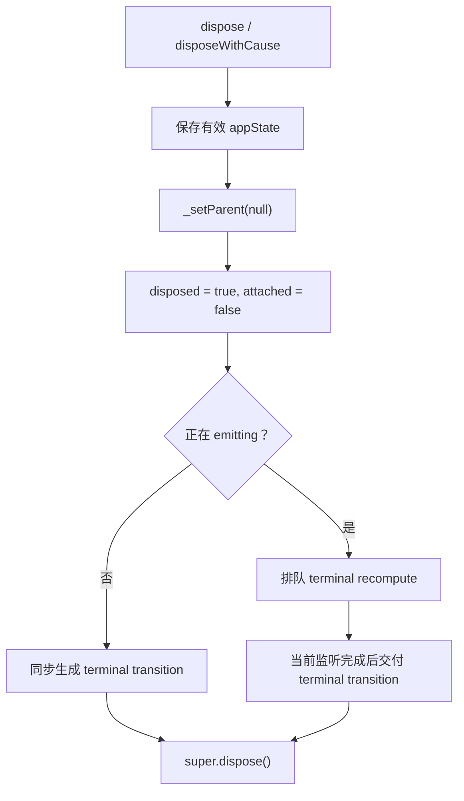

`_terminalAppState` 必须在断开父级前保存，否则 disposed 快照会丢失继承的
`AppLifecycleState`。这也是非透明 Dialog 关闭日志不再显示 unknown 的关键。

父 Controller 没有 children 集合；子节点通过监听父 `ChangeNotifier` 获知变化。父销毁
时 terminal 通知会令子节点重新合成为 hidden，但子节点保存的 `_parent` 诊断引用不会被
父级主动清除。

## 6. Scope 与节点装配

### 6.1 LifecycleScope

[lifecycle_scope.dart](../lib/src/core/lifecycle_scope.dart) 中公开的 `LifecycleScope` 是
`StatelessWidget`，内部再构建 `_LifecycleScopeData extends InheritedWidget`。

这样设计有两个效果：

- 公开构造器只接受 `controller` 和 `child`。
- 内部可以额外记录 `ModalRoute.of(context)`，不向调用方暴露路由识别细节。

`LifecycleScope.maybeOf/of` 通过 `_LifecycleScopeData` 注册依赖，Controller 或 Route 身份
变化时后代会重新执行依赖解析。

### 6.2 resolveLifecycleParent

父节点解析顺序：

```text
1. 读取最近 _LifecycleScopeData 和当前 ModalRoute。
2. 如果二者 Route 相同，使用该本地 Controller。
3. 否则让 Navigator 的 LifecycleRouteResolverScope 按 Route 查询 Controller。
4. Route 查询无结果时回退最近本地 Controller。
```

这使路由内部嵌套 Scope 优先，同时防止不同 Route 间直接继承错误节点。

### 6.3 LifecycleNodeBinding

[lifecycle_node_binding.dart](../lib/src/core/lifecycle_node_binding.dart) 是多个 Widget API 共用的
内部节点所有者：

| 方法 | 行为 |
| --- | --- |
| 构造器 | 创建 Controller，并可注册一个统一 `onChanged` |
| `syncParent` | 首次 attach，后续 reparent |
| `update` | 提交本地 Constraint |
| `dispatch` | 先调用 `onTransition`，再按顺序调用每个 `onEvent` |
| `buildScope` | 将节点 Controller 传播给子树 |
| `dispose` | 可选择是否在终止前解除 `onChanged` |

Binding 不继承 Widget 或 State，它只封装重复装配逻辑，所以可以被 Boundary、Builder、
Mixin、Page/Tab host 和 Viewport item 共同使用。

## 7. App 模块

### 7.1 AppLifecycleController

[app_lifecycle_controller.dart](../lib/src/app/app_lifecycle_controller.dart) 混入
`WidgetsBindingObserver`。构造过程：

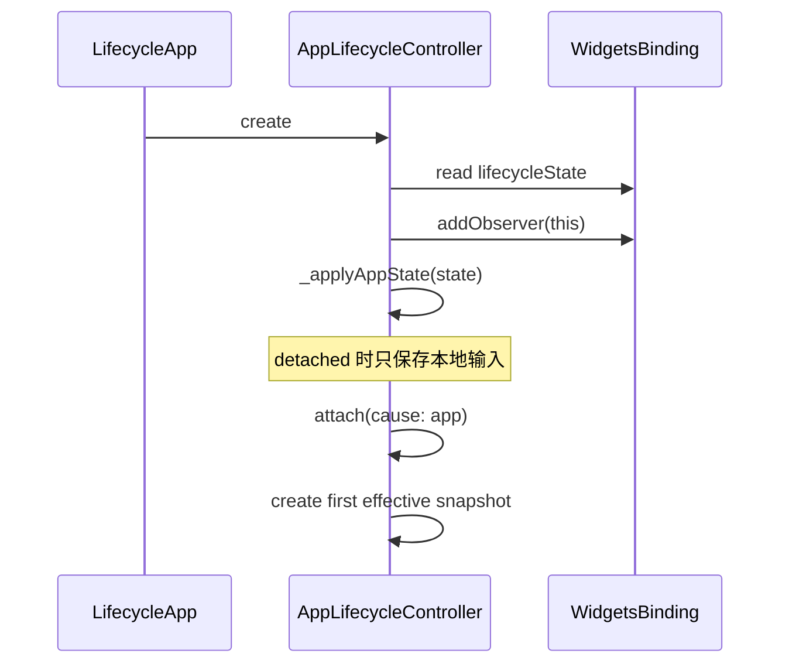

`didChangeAppLifecycleState` 只负责调用 `_applyAppState`。每个分支在一次 `updateLocal` 中
同时提交 Constraint、App 状态和 `LifecycleCause.app`。

dispose 时先 `removeObserver`，再终止 Controller，避免销毁后继续收到平台回调。

### 7.2 LifecycleApp

[lifecycle_app.dart](../lib/src/app/lifecycle_app.dart) 支持内部拥有或外部注入 Controller：

- `controller == null`：State 创建并负责 dispose。
- 外部传入：State 只传播，不释放。
- `didUpdateWidget` 替换时，只释放旧的内部自有对象。

build 仅返回一个以 App Controller 为根的 `LifecycleScope`。

## 8. Navigator 模块

### 8.1 为什么拆成 part

[navigator_lifecycle_controller.dart](../lib/src/navigation/navigator_lifecycle_controller.dart) 是主
library，另外三个文件通过 `part` 共享私有成员：

```text
navigator_lifecycle_controller.dart   # 路由历史和计算算法
├── navigator_lifecycle_observer.dart # Flutter 回调转发
├── navigator_lifecycle_scope.dart    # Widget 树接入和 route resolver
└── route_lifecycle_entry.dart        # Route + LifecycleController
```

这样既拆分职责，又不必把 `_handlePush`、`_controllerFor`、`_RouteLifecycleEntry` 等实现
提升为公开 API。

### 8.2 内部对象关系

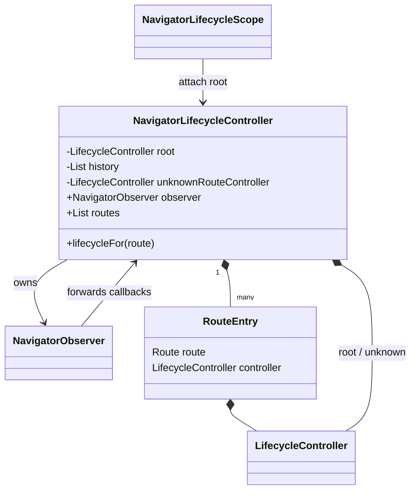

### 8.3 Scope 接入

`NavigatorLifecycleScope.didChangeDependencies` 调用 `_attach(parent)`：

- root 未挂接时 attach 到外层生命周期父节点。
- 已挂接时 reparent。
- root 本地约束更新为 active。

Scope 移除时 `_detach()` 只把 root 本地约束设为 hidden，不销毁 Controller，使同一个
Navigator Controller 可以在 Widget 更新期间重新接入。最终资源释放由调用方执行
`NavigatorLifecycleController.dispose()`。

build 会注入 `LifecycleRouteResolverScope(resolver: _controllerFor)`，Route 子树中的节点由此
绑定到自己的 Route entry。

### 8.4 Observer 回调表

| NavigatorObserver 回调 | Controller 行为 |
| --- | --- |
| `didPush` | 如未跟踪则追加 entry，然后重算全栈 |
| `didPop` | 移除并 dispose entry，然后重算 |
| `didRemove` | 同 pop |
| `didReplace` | 在原 index 创建新 entry，dispose 旧 entry |
| `didChangeTop` | 将已有 entry 移到栈顶并重算 |
| `didStartUserGesture` | 保存 previous Route，使用 `routeGesture` 重算 |
| `didStopUserGesture` | 清除手势 Route 并重算 |

replace 会忽略 `newRoute` 已存在的重复回调，避免同一个 Route 对应两个 Controller。

### 8.5 _recomputeRoutes

核心算法从栈顶向下：

```text
coveredByOpaqueRoute = false
for entry from top to bottom:
  gestureVisible = entry.route == gesturePreviousRoute
  visible = !coveredByOpaqueRoute || gestureVisible
  active = entry is stack top

  constraint = hidden, visible, or active
  entry.update(constraint, cause)

  if entry.route is opaque:
    coveredByOpaqueRoute = true
```

注意 `active` 只看是否为栈顶，但最终 Constraint 在不可见时优先选择 hidden。非透明栈顶
下方 Route 的 `visible == true`、`active == false`，因此得到 visible。

### 8.6 Route 移除后的 resolver

`_controllerFor` 从栈顶向下按对象身份查询 Route。查不到时返回
`_unknownRouteController`，因为被移除 Route 的退出动画可能仍在构建依赖。unknown 节点
固定 hidden，可以阻止子树错误回退到 App Scope。

Navigator Controller 已 dispose 时，该方法返回 `null`，避免 teardown 阶段尝试把子节点
挂到已销毁 unknown Controller。

### 8.7 removeRoute

公开 `removeRoute<T>(Route<T>, [T? result])` 不直接修改 `_history`，而是调用 Flutter
`NavigatorState.removeRoute`。随后标准 Observer 回调负责更新历史，确保只有一条状态
变更路径。

## 9. PageView 与 TabBarView 模块

### 9.1 共享的 IndexedLifecycleRegistry

[indexed_lifecycle_scope.dart](../lib/src/page/indexed_lifecycle_scope.dart) 包含一个轻量 registry。
它只保存已经实例化的 host State，不会为了同步生命周期主动创建离屏页面。

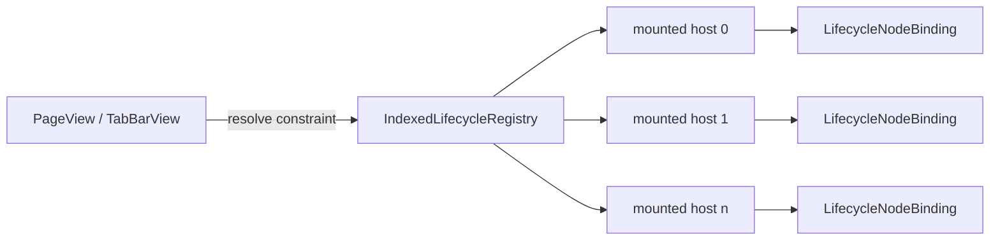

`syncAll` 先复制 `_hosts` 再遍历，避免 host 在通知过程中注册或注销导致并发修改。每个 host
在 `didChangeDependencies` 中同步父级，在 index 或 registry 变化时迁移注册关系。

### 9.2 LifecyclePageView

[lifecycle_page_view.dart](../lib/src/page/lifecycle_page_view.dart) 的关键状态：

- `_selectedIndex`：滚动结束后确认的页。
- `_scrolling`：由深度为 0 且 metrics 为 `PageMetrics` 的通知维护。
- `_registry`：所有已实例化页面的 host。

初始化调用链：

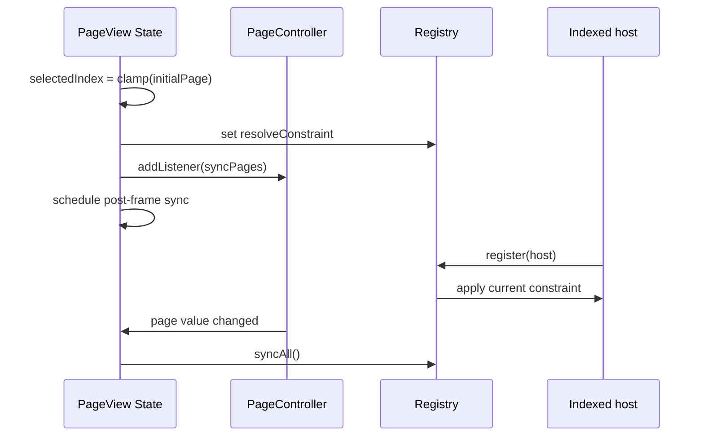

`_constraintFor(index)` 使用 `1 - abs(page - index)` 计算比例。`_scrolling == true` 时可见页
只得到 visible；停止后 `_selectedIndex` 对应页才得到 active。

#### 稳定身份与重排

页面 ID 优先级为：

```text
pageIdBuilder(index) -> child.key -> index
```

ID 被包装为 `_LifecyclePageKey` 并传给 `IndexedLifecycleScope`。PageView 的
`findChildIndexCallback` 再通过 `findPageIndex` 或固定 children 扫描反查新 index。这样数据
重排后旧 Element/State/Controller 能跟随 ID 移动。

builder 数据可能重排时，应同时提供 `pageIdBuilder` 和 `findPageIndex`；只提供 ID 而无法
反查 index，Flutter 仍可能无法迁移已存在 child。

#### Controller 替换

`didUpdateWidget` 会成对移除/添加监听器，重置初始 index 和滚动标记，并在下一帧读取新
Controller 的真实 page。回调还检查 State 是否 mounted、Controller 是否仍为同一对象，
避免快速连续替换后旧 post-frame callback 覆盖新状态。

### 9.3 LifecycleTabBarView

[lifecycle_tab_bar_view.dart](../lib/src/page/lifecycle_tab_bar_view.dart) 同时监听：

- `TabController`：index、offset、indexIsChanging。
- `TabController.animation`：连续动画值。

比例算法与 PageView 相同。settled 条件是 `!indexIsChanging && abs(offset) < 0.0001`。
Controller 替换时，两组 listener 都成对迁移。

## 10. Viewport 模块

[viewport_lifecycle_item.dart](../lib/src/viewport/viewport_lifecycle_item.dart) 是实现最复杂的
适配器，由三个层次组成：

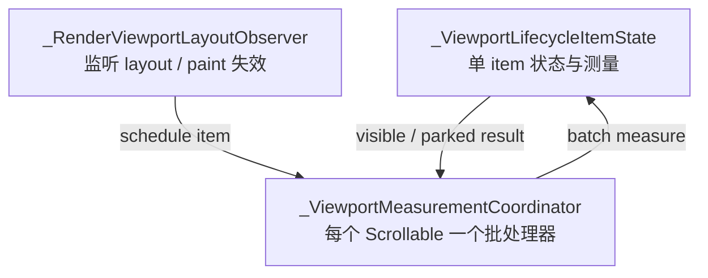

### 10.1 注册过程

`didChangeDependencies` 执行：

1. 通过 Binding 同步生命周期父节点。
2. 调用 `Scrollable.maybeOf(context)` 查找最近 Scrollable。
3. 缺失时抛出明确 `FlutterError`。
4. 从全局 Map 取该 `ScrollableState` 对应 Coordinator。
5. Scrollable 改变时从旧 Coordinator 注销、向新 Coordinator 注册。

Map 的 key 是 `ScrollableState` 对象，不是 BuildContext 或 ScrollController。最后一个 item
注销时，Coordinator 解除 ScrollPosition 监听并从 Map 删除，不会永久形成全局缓存。

### 10.2 ScrollPosition 迁移

Coordinator 的 `_syncPosition` 比较当前 `scrollable.position`：

- 解除旧 position 和旧 `isScrollingNotifier`。
- 监听新 position 的 offset 变化。
- 监听新 position 的滚动状态。

这覆盖 ScrollController 或 ScrollPosition 在 Widget 更新中的替换。

### 10.3 帧调度与候选集

所有入口最终调用 `scheduleMeasurement`，而 `_measurementScheduled` 确保每帧最多注册一个
post-frame callback。

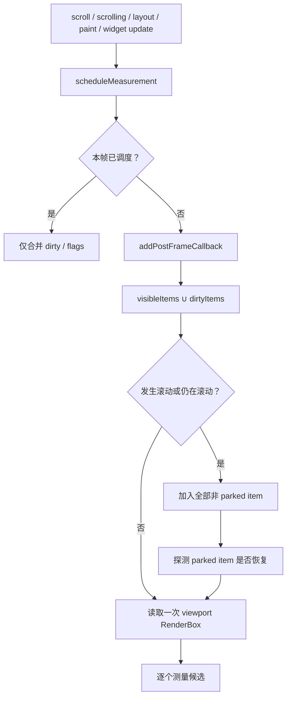

相关集合：

| 集合 | 内容 |
| --- | --- |
| `_items` | 该 Scrollable 下全部已注册 item |
| `_geometricallyVisibleItems` | 上次原始 fraction 大于零的 item |
| `_dirtyItems` | layout/paint/参数更新后需要测量的 item |
| `_parkedItems` | 位于 Sliver keep-alive bucket 的 item |

稳定滚动时会测量所有非 parked 挂载 item，以保证快速 fling 不漏测。非滚动布局更新只需
处理可见与 dirty item。

### 10.4 几何测量

单 item 的 `_measureVisibility`：

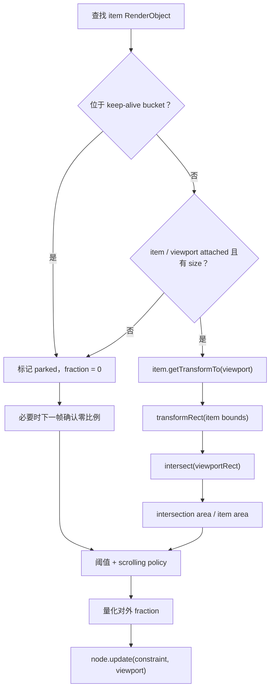

`getTransformTo` 或矩阵转换异常时捕获 `FlutterError` 并按 fraction 0 处理，避免 RenderObject
刚分离时中断整批测量。

### 10.5 阈值与量化

判断顺序：

```text
visible = rawFraction > 0 && rawFraction >= visibleThreshold
active  = rawFraction > 0
          && rawFraction >= activeThreshold
          && (policy == immediate || !isScrolling)
```

随后 `_stabilizeFraction` 将对外比例按默认 0.01 四舍五入。阈值使用 rawFraction，因此
量化不会让一个尚未达到阈值的 item 提前 visible/active。

### 10.6 KeepAlive 检测

item 自己的 RenderBox 可能被 Padding、RepaintBoundary 等包裹。`_isKeptAlive` 从当前
RenderObject 沿 `parent` 向上查找，直到发现
`SliverMultiBoxAdaptorParentData.keptAlive`。

parked item 保持注册，但不执行 `getTransformTo`。滚动批次仅检查 ParentData；一旦恢复，
重新加入 candidates 做完整测量。

### 10.7 零比例二次确认

当满足以下条件时，第一次 fraction 0 不立即提交：

- 上一次 `_appliedFraction > 0`。
- 当前没有等待确认。
- 自上次测量后 ScrollPosition 未改变。

实现设置 `_zeroFractionPending`、请求下一帧并调用 `ensureVisualUpdate`。这是为了过滤外层
PageView 重新挂接 keep-alive Scrollable 时的瞬时无几何状态。真实滚动会设置
`_positionChanged`，因此离屏 item 不会被延迟隐藏。

### 10.8 RenderObject observer

`_ViewportLayoutObserver` 是 `SingleChildRenderObjectWidget`，创建一个不改变布局和绘制结果
的 `RenderProxyBox`。它在 `performLayout` 和 `paint` 完成后仅调用调度回调。

这里不能直接同步测量：布局/绘制过程中读取其他 RenderObject 几何容易遇到尚未稳定的
树状态。Coordinator 将请求合并到 post-frame 后统一处理。

## 11. Widget 消费模块

### 11.1 LifecycleListener

[lifecycle_listener.dart](../lib/src/widgets/lifecycle_listener.dart) 中 Listener 的 Binding 默认
Constraint 为 active，因此它只继承并转发父级有效状态，不额外限制子树。build 直接返回
`child`，自身不会因状态变化 rebuild。

Binding 的 `_handleChanged` 先交付一次 `onTransition`，再依次交付 Transition 内所有
`onEvent`。

### 11.2 LifecycleBuilder

Builder 的监听器调用 `setState`，并将 `_node.value` 传给 builder。它会对任何 Snapshot
字段变化重建，包括 Phase 不变但 fraction 或 appState 变化。

dispose 时调用：

```dart
_node.dispose(deliverTerminalTransition: false);
```

Binding 会先从 Controller 移除 `_handleChanged`，避免 Controller 生成 terminal snapshot
时在 State dispose 阶段触发 `setState`。其他监听器仍可正常观察 Controller 的终止状态。

### 11.3 LifecycleBoundary

[lifecycle_boundary.dart](../lib/src/widgets/lifecycle_boundary.dart) 用 Widget 参数初始化 Binding
的本地 Constraint。`didUpdateWidget` 只在 Constraint 值变化时调用 update，并保留调用方
设置的 Cause。

Boundary build 会创建新的 `LifecycleScope`，所以限制不仅影响自己的回调，也影响全部
后代生命周期节点。

### 11.4 LifecycleStateMixin

[lifecycle_state_mixin.dart](../lib/src/widgets/lifecycle_state_mixin.dart) 将 Binding 生命周期映射
到 State：

| State 回调 | Mixin 行为 |
| --- | --- |
| `initState` | 创建 Binding |
| `didChangeDependencies` | attach/reparent 到有效父节点 |
| Controller changed | 调用 `onLifecycleTransition`，再遍历 `onLifecycleEvent` |
| `dispose` | 终止 Binding 后调用 `super.dispose()` |

Mixin 公开只读 `lifecycle` getter，业务 State 无需直接持有 Controller。

## 12. 一条完整源码调用链

以“非透明 Dialog 打开，底层页面从 active 变为 visible”为例：

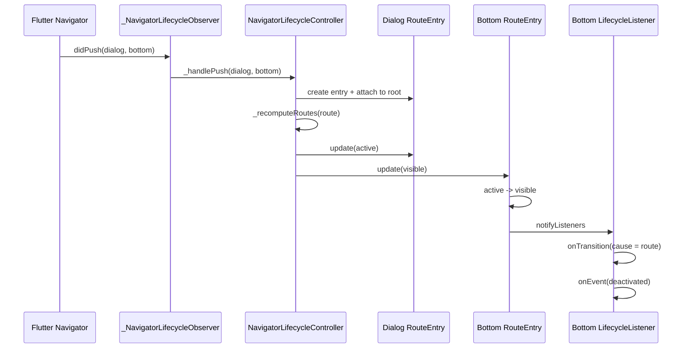

Dialog 关闭时，Observer 移除并 dispose Dialog entry，再把底层 Route 更新为 active。Dialog
终止快照在断开父节点前保存继承的 appState，所以关闭日志仍能读取准确的应用状态。

## 13. 资源所有权与销毁顺序

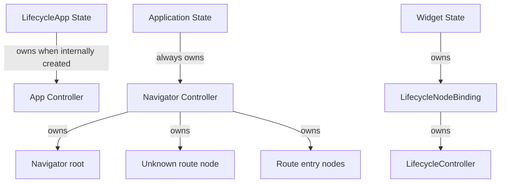

推荐销毁顺序：

1. 子 Widget State 释放自己的 Binding。
2. Navigator Scope 从外层树 detach。
3. 创建 Navigator Controller 的 State 调用其 `dispose`。
4. LifecycleApp 最后释放内部 App Controller。

Flutter 的实际 Element teardown 会按树结构调用 dispose；实现中的幂等保护和 disposed
resolver 回退用于覆盖 teardown 阶段的短暂交错。

## 14. 测试如何对应实现

| 测试文件 | 主要覆盖 |
| --- | --- |
| `test/lifecycle_controller_test.dart` | 状态合成、事件顺序、成环、重入、异常、销毁、随机状态机 |
| `test/app_navigation_test.dart` | App 映射、Scope、Boundary、Mixin、路由透明度、手势、嵌套与声明式 Navigator |
| `test/page_lifecycle_test.dart` | Page/Tab 比例、滚动 settled、稳定 ID、重排、Controller 迁移、嵌套页面 |
| `test/viewport_lifecycle_test.dart` | List/Grid/Sliver、横向滚动、阈值、fling、KeepAlive、粒度与 Position 迁移 |
| `example/test/app_test.dart` | Demo Widget 流程和交互入口 |
| `example/integration_test/app_flow_test.dart` | 真正 Flutter engine 上的路由、PageView、fling、嵌套 Navigator 冒烟流程 |

核心状态机测试还包含固定 seed 的参考模型随机测试。它反复执行 Constraint、App 状态、
attach/reparent 等操作，并把实现结果与独立模型比较，用于发现手写边界用例没有枚举到的
状态组合。

## 15. 扩展一个新的生命周期容器

如果要实现例如 Carousel、可折叠面板或自定义渲染视口，推荐沿用现有模式：

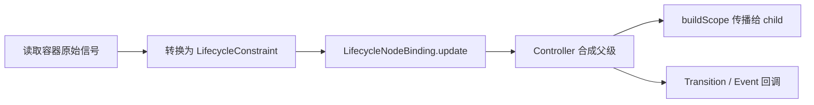

实现时应遵守：

1. 原始信号只在适配器中解释，核心 Controller 不感知具体容器。
2. 用一个规范化 Constraint 原子提交状态，避免分别更新 visible/active/fraction。
3. 在 `didChangeDependencies` 中调用 `syncParent`。
4. 高频信号先按帧合并或量化，再调用 update。
5. 使用稳定 Widget Key 保持节点身份。
6. dispose 时先解除外部信号监听，再 dispose Binding。
7. 需要 `setState` 的内部回调在终止前解除；纯业务终止回调可以保留。

## 16. 调试定位建议

### 状态不符合预期

从叶子节点开始沿 `controller.parent` 向上检查：

- 每层 `localConstraint` 是否符合容器原始信号。
- 父层 `value.phase` 是否已经限制子层。
- `visibleFraction` 是在哪一层被 `min` 收窄。
- `lastTransition.cause` 指向哪个适配器。

### 回调没有执行

检查：

- Snapshot 是否真的发生值变化；等值更新不会通知。
- 需要的是 `onTransition` 还是只有 Phase 边沿才产生的 `onEvent`。
- Widget 是否位于 `LifecycleScope`、Route resolver 或正确 Scrollable 下。
- Page/Tab/Viewport 是否仍在滚动，默认策略下滚动期间不会 active。

### 出现短暂 hidden/active 抖动

优先确认：

- Page/Tab 是否使用稳定 Key 和 ID 反查。
- Viewport item 是否跨 Scrollable 或 ScrollPosition 迁移。
- 自定义适配器是否在 layout 过程中同步读取几何，而没有延迟到帧末。
- 是否绕过 Constraint 一次性更新，在多个回调中分开提交相关状态。

## 17. 总结

源码的主线可以浓缩为：**适配器产生本地 Constraint，Controller 与父 Snapshot 取交集，
Scope 传播节点，Transition 将结果交付给消费者。**

Navigator、Page/Tab 和 Viewport 的复杂度主要用于正确解释各自的 Flutter 信号；它们不会
复制生命周期状态机。只要新的容器也遵守这一边界，就能与 App、Route 和其他节点自动
组合。
