# lifecycle 技术原理

本文解释 `lifecycle` 1.0 的设计目标、状态模型和关键算法。它关注“为什么这样设计”以及
各类 Flutter 生命周期信号如何组合，不深入逐行源码；具体实现请继续阅读
[源码解析](SOURCE_CODE_ANALYSIS_CN.md)。

## 1. 要解决的问题

Flutter 中与“当前 Widget 是否适合工作”有关的信号分散在不同层级：

- `AppLifecycleState` 只描述整个应用是否位于前台。
- `Navigator` 只知道路由栈、路由透明度和返回手势。
- `PageView`、`TabBarView` 只知道选中页和切换动画。
- `Scrollable` 只提供滚动位置，不直接给出每个元素的二维可见比例。
- Widget 的 `initState`/`dispose` 只能描述挂载关系，无法表示“仍挂载但被遮挡”。

单独监听其中任意一个信号都会遗漏其他层级。例如，列表元素即使完全位于视口内，
其所属路由被新页面遮挡时也不应该继续播放视频。该库将这些信号组织为一棵只能逐层
收窄状态的生命周期树。

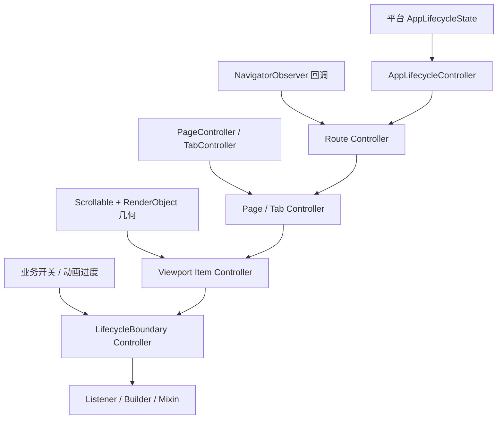

核心规则是：**子节点可以比父节点更不活跃，但不能比父节点更活跃。**

## 2. 总体架构

系统可分为四层：

| 层级 | 主要对象 | 职责 |
| --- | --- | --- |
| 信号适配层 | `AppLifecycleController`、Navigator observer、Page/Tab、Viewport | 将 Flutter 原始信号转换为规范化约束 |
| 状态机层 | `LifecycleController` | 合成父子状态、生成快照、推导事件并通知后代 |
| 传播层 | `LifecycleScope` | 通过 Widget 树传递最近的 Controller，并处理 Route 归属 |
| 消费层 | `LifecycleListener`、`LifecycleBuilder`、`LifecycleStateMixin` | 执行副作用或根据快照构建界面 |

架构不依赖全局事件总线。每个 Navigator、Page、Viewport item 都持有稳定节点，节点之间
通过父子引用组合。这使嵌套 Navigator、路由中的 PageView、PageView 中的列表可以自然
形成一条状态限制链。

## 3. 四个核心概念

### 3.1 LifecycleConstraint：本地能力上限

`LifecycleConstraint` 表示节点自身允许达到的最高状态，尚未与父节点合成。它只有三种
合法形态：

| 构造器 | 本地可见 | 本地活跃 | 可见比例 |
| --- | --- | --- | --- |
| `hidden()` | 否 | 否 | 固定为 0 |
| `visible(fraction)` | 是 | 否 | `(0, 1]` |
| `active(fraction)` | 是 | 是 | `(0, 1]` |

使用命名构造器而不是多个独立布尔值，可以从类型入口排除“不可见但活跃”“隐藏但比例
大于零”等矛盾状态。

### 3.2 LifecycleSnapshot：合成后的事实

`LifecycleSnapshot` 是节点与全部祖先合成后的不可变结果。它增加了两个终端阶段：

| Phase | attached | visible | active | 含义 |
| --- | ---: | ---: | ---: | --- |
| `detached` | 否 | 否 | 否 | Controller 已创建但尚未接入树 |
| `hidden` | 是 | 否 | 否 | 节点存在，但被自身或祖先隐藏 |
| `visible` | 是 | 是 | 否 | 可见，但不是当前交互目标 |
| `active` | 是 | 是 | 是 | 可见且允许执行前台工作 |
| `disposed` | 否 | 否 | 否 | 永久终止，不可再次使用 |

`phase` 是唯一状态源，`attached`、`visible`、`active` 都由它派生。快照还携带：

- `visibleFraction`：最终有效可见比例。
- `appState`：本节点覆盖值或从祖先继承的最新应用状态。

### 3.3 LifecycleTransition：一次原子变化

`LifecycleTransition` 同时保存：

- `previous`：变化前快照。
- `current`：变化后快照。
- `cause`：变化来源。
- `events`：从前后快照差异推导出的有序语义事件。

因此消费者既可以比较连续值（例如 `visibleFraction` 从 0.52 变为 0.61），也可以只处理
一次性边沿事件（例如 `activated`）。

### 3.4 Event 与 Cause：发生了什么、为什么发生

`LifecycleEvent` 回答“发生了什么”，`LifecycleCause` 回答“为什么发生”：

| Event | 语义 |
| --- | --- |
| `created` | 节点第一次从未挂接进入生命周期树 |
| `appeared` | 从不可见变为可见 |
| `activated` | 从非活跃变为活跃 |
| `deactivated` | 从活跃退出 |
| `disappeared` | 从可见变为不可见 |
| `disposed` | 节点永久销毁 |

| Cause | 来源 |
| --- | --- |
| `app` | 应用前后台状态 |
| `route` | 路由栈或透明度 |
| `routeGesture` | Navigator 交互式返回手势 |
| `pageSelection` | PageView/TabBarView 选择与动画 |
| `viewport` | 视口几何和滚动状态 |
| `widgetTree` | Widget 挂载、换父级或销毁 |
| `custom` | 业务自定义边界 |

同一 Transition 可能包含多个 Event。例如 `active -> hidden` 会依次产生
`deactivated`、`disappeared`，但只对应一次通知和一个 Cause。

## 4. 父子状态合成

设父快照为 `P`，当前节点本地约束为 `L`，最终快照为 `E`：

```text
E.fraction = min(P.fraction, L.fraction)
E.visible  = P.visible && L.visible && E.fraction > 0
E.active   = E.visible && P.active && L.active
E.appState = localAppState ?? P.appState
```

根节点没有父级时，父级默认视为 `active + fraction 1.0`。这套“取交集”模型具有两个重要
性质：

1. 任意祖先隐藏都会让整个后代链隐藏。
2. 局部节点恢复活跃并不会越过仍处于非活跃状态的祖先。

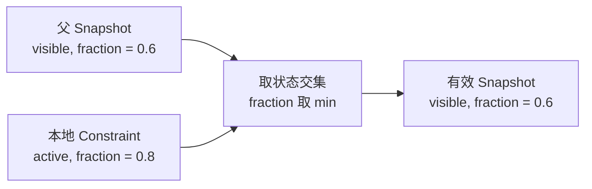

上例中，本地虽然允许 `active`，但父节点仅为 `visible`，所以结果最多只能是
`visible`；可见比例也被父级的 0.6 限制。

### 一棵真实的组合树

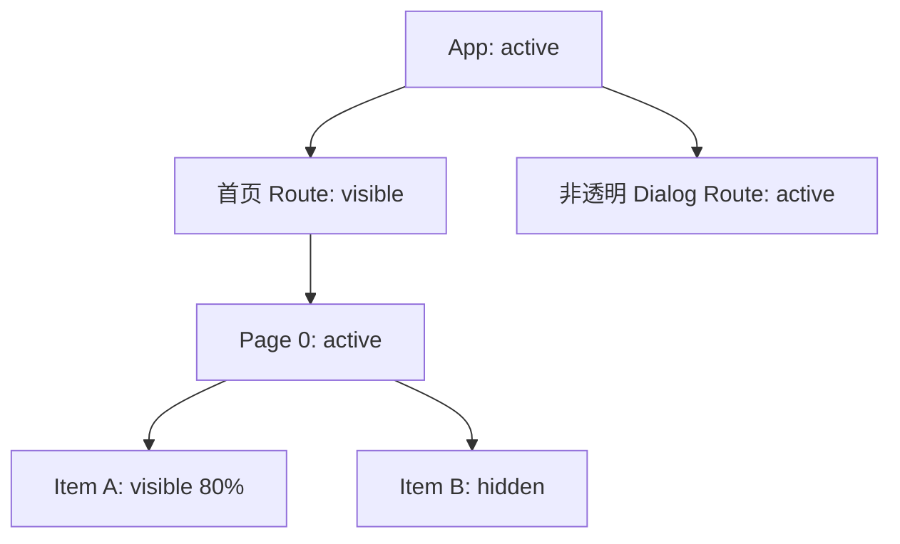

非透明 Dialog 出现后，首页仍可见但不活跃。即使 Page 和 Item 的本地约束仍为
`active`，它们的有效状态也会被首页 Route 限制为 `visible`。

## 5. 状态转换与事件顺序

状态并不是简单的线性枚举，但语义事件始终遵循“先退出旧状态，再进入新状态，最后
终止”的顺序：

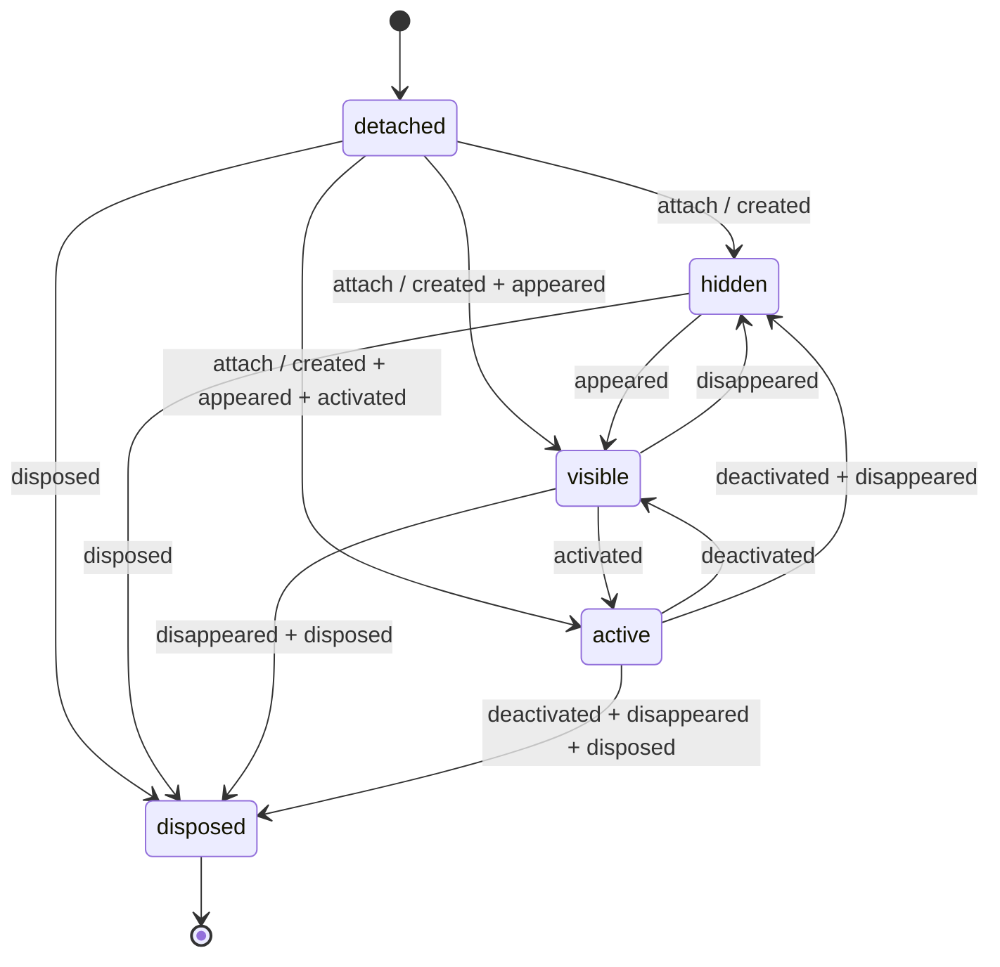

快照的 `appState` 或 `visibleFraction` 发生变化时，Phase 可能保持不变。此时仍会生成
Transition，但 `events` 可以为空。这正是同时保留 `onTransition` 和 `onEvent` 的原因：

- `onTransition` 适合观察每个有效值变化。
- `onEvent` 适合启动、暂停、释放等离散副作用。

## 6. 同步通知与重入安全

Controller 使用标准 `ChangeNotifier` 通道。更新流程是同步的，但通知期间发生的再次
更新不会递归深入，而是合并到下一轮重新计算。

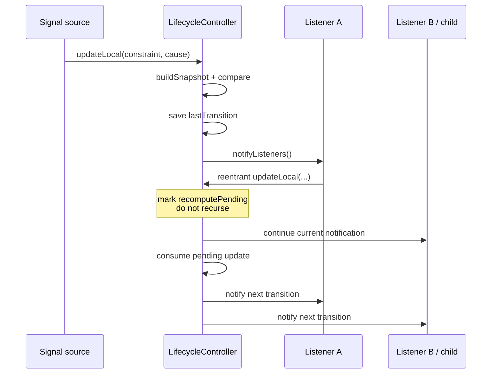

关键保证：

- `value` 会在监听器执行前更新。
- 监听器可同步读取与该 `value` 对应的 `lastTransition`。
- 每个 Transition 的 `previous` 等于上一次已经交付的 `current`。
- 相同约束和 App 状态会等值短路，不创建无意义快照。
- Flutter `ChangeNotifier` 会隔离并上报单个监听器异常，后续监听器仍可收到通知。
- 通知期间调用 `dispose` 时，终止快照会排入下一轮，通知完成后再释放
  `ChangeNotifier`。

## 7. App 生命周期映射

`AppLifecycleController` 是整棵树的常见根节点。映射规则如下：

| AppLifecycleState | Constraint | 设计含义 |
| --- | --- | --- |
| `resumed` | `active` | 应用位于前台且可交互 |
| `inactive` | `visible` | 仍可能可见，但暂不应执行活跃工作 |
| `hidden` | `hidden` | 所有视图均不可见 |
| `paused` | `hidden` | 应用处于后台 |
| `detached` | `hidden` | Engine 与宿主视图分离 |

Constraint 与原始 `appState` 在一次 `updateLocal` 中同时更新，避免先改变可见性、后改变
App 状态产生中间不一致快照。

## 8. Navigator 路由算法

每个 Navigator 必须拥有独立的 `NavigatorLifecycleController`。它维护一份从栈底到栈顶
的 Route entry 列表，每个 entry 对应一个稳定的 `LifecycleController`。

### 8.1 不透明遮挡

路由状态从栈顶向下扫描：

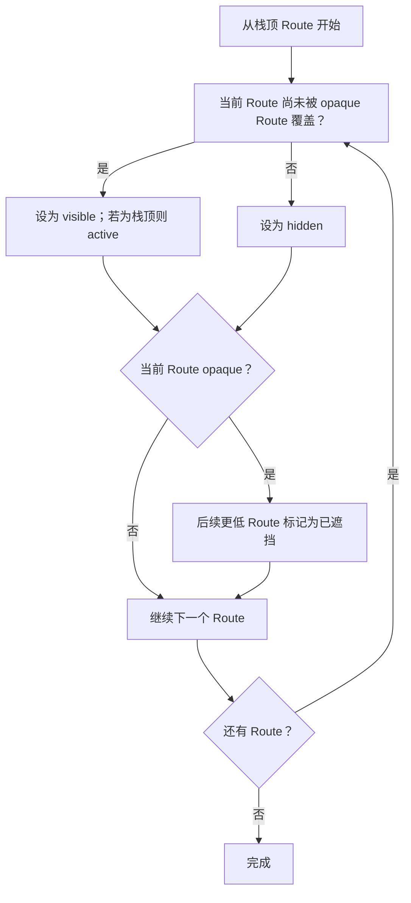

因此：

- 普通全屏页面会隐藏其下方页面。
- 非透明 Dialog 自身活跃，下方页面保持可见但不活跃。
- 只有栈顶 Route 可以在本地约束层面成为 active。

### 8.2 交互式返回

返回手势开始时，`previousRoute` 被额外标记为可见，即使它原本位于不透明路由之下；
它仍不是栈顶，所以不会活跃。手势结束后清除该例外，再按当前路由栈重新计算。

### 8.3 移除动画中的未知 Route

Route 从历史中移除后，其 Widget 子树可能因退出动画继续挂载。此时 resolver 返回一个
固定为 hidden 的内部 Controller，而不是错误回退到 App 根节点。这样退出中的页面不会
短暂恢复活跃。Navigator Controller 销毁后 resolver 返回 `null`，允许 Widget 树按正常
Scope 规则完成 teardown。

## 9. PageView 与 TabBarView

### 9.1 PageView 可见比例

PageView 使用 `PageController.page` 的连续值计算每个已实例化页面的比例：

```text
fraction(index) = max(0, 1 - abs(currentPage - index))
```

例如 `currentPage = 1.25`：

| Page | fraction | 滚动期间状态 |
| ---: | ---: | --- |
| 0 | 0 | hidden |
| 1 | 0.75 | visible |
| 2 | 0.25 | visible |
| 3 | 0 | hidden |

滚动期间所有页面最多为 `visible`；只有收到滚动结束信号后，中心选中页才提升为
`active`。这可以避免拖动边界附近两个页面反复争夺活跃状态。

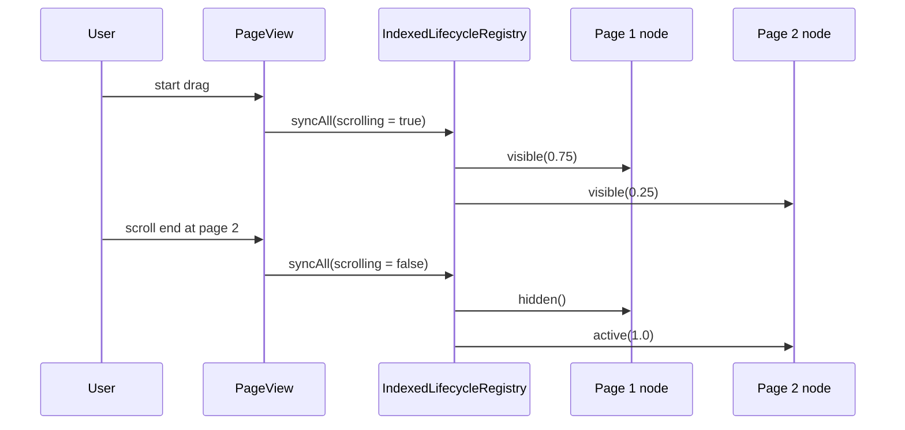

稳定 page ID 会被包装成内部 Key，并与 `findChildIndexCallback` 配合。数据重排后 Flutter
可以把旧 State 和生命周期 Controller 移动到新 index，而不是销毁后重建。

### 9.2 TabBarView

TabBarView 使用 `TabController.animation.value` 计算同样的线性比例。只有同时满足以下
条件时，选中 Tab 才 active：

- `indexIsChanging == false`
- `abs(offset) < 0.0001`
- 当前 index 等于 `controller.index`

这同时覆盖点击切换动画和手势拖动。

## 10. Viewport 二维可见性

`ViewportLifecycleItem` 将元素矩形转换到最近 `Scrollable` 的局部坐标系，并以二维面积
计算真实可见比例：

```text
fraction = area(itemRect ∩ viewportRect) / area(itemRect)
```

二维面积而不是单轴长度，使同一算法可以用于垂直列表、水平列表、GridView 和
CustomScrollView。

### 10.1 从几何到生命周期

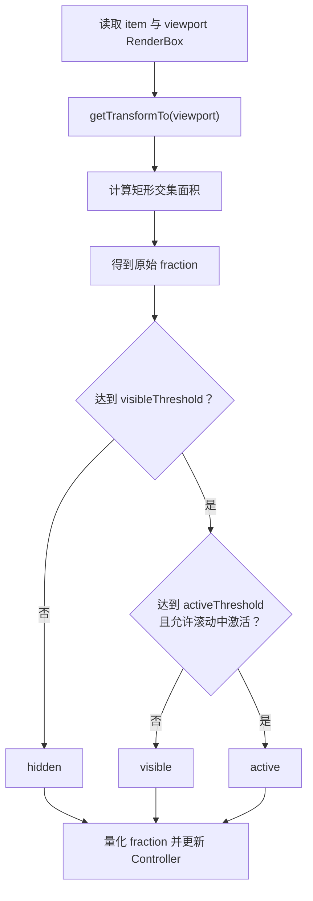

阈值判断始终使用原始 fraction；默认 1% 粒度的量化只作用于对外快照，用于减少浮点
抖动和无效通知。`activeThreshold` 未设置时等于 `visibleThreshold`。

默认策略 `whenScrollSettles` 会在滚动期间禁止 active，滚动停止后再提升满足阈值的
item。`immediate` 则允许滚动中的 item 立即 active。

### 10.2 按 Scrollable 批量测量

同一个 `ScrollableState` 下的所有 item 共用一个 Coordinator：

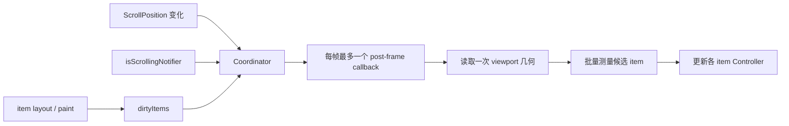

候选集由“上一批几何可见的 item”和“发生布局/绘制的 dirty item”组成。真实滚动期间还会
纳入所有非 parked 的挂载 item，保证快速 fling 时不会漏掉新进入视口的元素。

### 10.3 KeepAlive 与瞬时零几何

Sliver keep-alive bucket 中的 RenderBox 可能仍 attached，但坐标变换已经陈旧。实现沿
RenderObject 父链检查 `SliverMultiBoxAdaptorParentData.keptAlive`：

- parked item 不执行昂贵且可能错误的 `getTransformTo`。
- 滚动批次只廉价检查它是否离开 bucket。
- 恢复后再加入完整测量候选。

非滚动场景下，外层 PageView 重新挂接 Scrollable 时可能短暂得到零几何。若 item 上一帧
仍可见，实现会等待下一帧确认，以避免假的 `deactivated -> activated`。如果零比例来自
真实滚动，则立即隐藏，保证快速滑动的响应及时。

## 11. Scope 与 Route 归属

`LifecycleScope` 的公开职责只有传播 Controller。内部 Scope 同时记录构建时所在的
`ModalRoute`，用于避免跨 Route 错误继承。

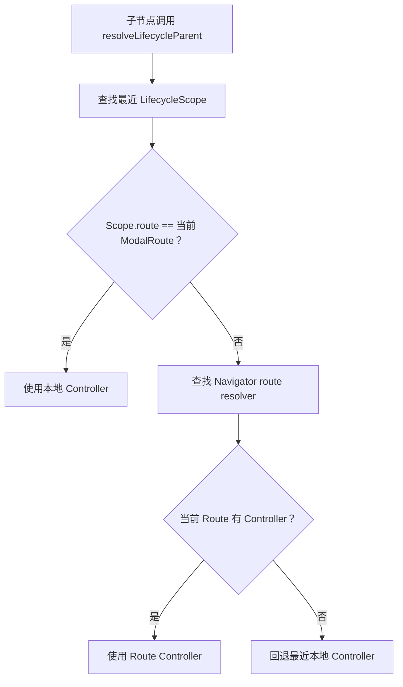

该顺序既允许 Route 内部的 Page、Boundary 等局部 Scope 优先，又能让路由根部准确绑定到
对应 Route Controller，而不是直接绑定 App 根节点。

## 12. Widget API 为什么共享一个 Binding

`LifecycleListener`、`LifecycleBuilder`、`LifecycleBoundary`、Page/Tab item 和 Viewport
item 都需要完成同一组操作：

1. 创建并持有 Controller。
2. 在 `didChangeDependencies` 中解析或更换父节点。
3. 将 Controller 重新包装为后代 Scope。
4. 分发 Transition/Event。
5. 在 Widget dispose 时终止节点。

这些操作由内部 `LifecycleNodeBinding` 统一处理，防止不同 Widget 对 attach、reparent、
监听器和 dispose 顺序作出不一致实现。

`LifecycleBuilder` 是一个特殊消费者：它的监听回调会调用 `setState`，所以 dispose 前先
移除回调，不交付 terminal transition。Listener、Boundary 和 Mixin 的回调不是框架重建
回调，因此仍可接收最终 `disposed` 事件。

## 13. 生命周期、所有权与释放

| 对象 | 谁创建 | 谁释放 |
| --- | --- | --- |
| `LifecycleApp` 内部 App Controller | `LifecycleApp` | `LifecycleApp` |
| 注入 `LifecycleApp.controller` 的 Controller | 调用方 | 调用方 |
| `NavigatorLifecycleController` | 调用方 | 调用方 |
| Route entry Controller | Navigator Controller | Navigator Controller/Observer |
| Listener/Boundary/Builder/Mixin 节点 | 对应 Widget/State | 对应 Widget/State |
| Page/Tab/Viewport item 节点 | item State | item State |

Controller 一旦进入 `disposed` 就不可重新 attach 或 update。销毁前会保留最新的有效
`appState` 到终止快照，因此即使节点先与父级断开，消费者仍能知道它终止时应用所处
状态。

父节点先销毁时，子节点会收到父终止通知并变为 hidden；出于实现成本和诊断价值考虑，
子节点的 `parent` getter 会继续指向已销毁父对象，直到子节点主动 reparent 或销毁。

## 14. 设计取舍与适用边界

### 适合的场景

- 页面曝光、视频播放、轮询任务、动画和传感器的启停。
- 嵌套 Navigator、非透明弹层和交互式返回。
- PageView/TabBarView 中的页面级工作管理。
- List/Grid/Sliver 元素的可见比例统计。
- 业务弹层、折叠面板等自定义状态边界。

### 需要注意

- `visible` 是几何/结构意义上的可见，不判断像素是否被任意兄弟 Widget 绘制覆盖。
- Viewport 测量以元素矩形面积为单位，不计算裁剪路径、透明度或不规则形状的实际像素。
- 只有接入对应 Scope 的子树才能获得完整组合；每个嵌套 Navigator 都需要独立配置。
- `ChangeNotifier` 通知是同步的，耗时业务应自行异步调度，避免阻塞 UI 帧。
- 生命周期事件适合控制工作状态，不应替代 Widget 本身的资源所有权和 `dispose`。

## 15. 一次完整信号传播示例

假设用户正在首页 PageView 的第二页浏览一个列表元素，此时应用进入后台：

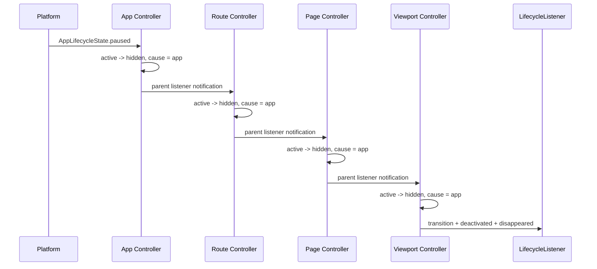

每个节点保留自己的本地约束。应用再次 `resumed` 时，状态会沿树向下重新合成：只有路由
仍在顶层、页面仍被选中、item 仍满足视口阈值时，最终节点才会重新 `activated`。
